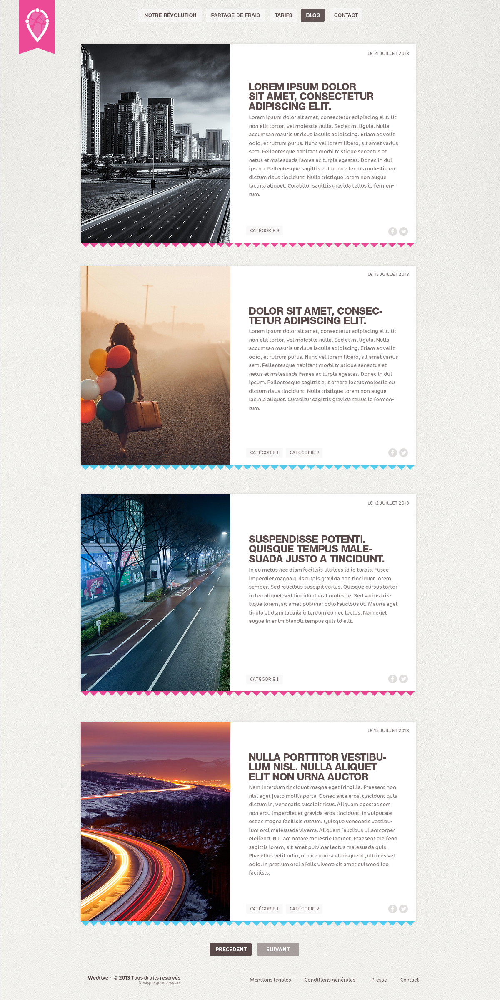

# Intégration HTML / CSS

Exercice supplémentaire donné en guise de révision dans le cadre de ma formation.

Il faut réaliser une intégration sur le modèle de la maquette suivante.

Le passage en responsive doit se faire dans un second temps, histoire de compliquer la tache.

